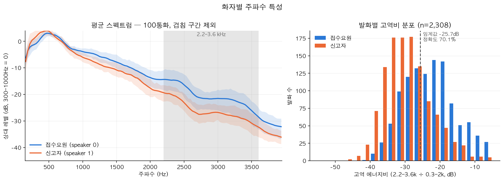

# Mission 2 — 화자별 주파수 특성과 채널 누수

측정: 서울 샘플 100통화 / 2,434발화
재현: `python src/spectrum.py --label_dir <02.라벨링데이터> --audio_dir <01.원천데이터>` → `python src/make_figure.py`



## 발견

접수요원과 신고자의 평균 스펙트럼이 2.2–3.6kHz 구간에서 일관되게 벌어진다.
겹쳐 말하는 구간을 제거하고 화자별로 모아 Welch PSD를 계산했다 (8kHz, 256샘플 창, 300–1000Hz를 0dB로 정규화).

| 주파수 | 접수요원(0) | 신고자(1) | 차 |
|---|---|---|---|
| 1,000 Hz | −3.9 dB | −6.0 dB | +2.1 |
| 2,000 Hz | −13.7 dB | −17.6 dB | +4.0 |
| 2,500 Hz | −16.4 dB | −23.1 dB | +6.7 |
| 3,000 Hz | −21.5 dB | −26.8 dB | +5.3 |
| 3,500 Hz | −26.1 dB | −30.8 dB | +4.7 |

고역 에너지비(2.2–3.6kHz ÷ 0.3–2kHz) 하나로 임계값만 그어도:

```
발화 단위 단일 임계값 정확도   70.1%  (n=2,308, thr −25.7dB)
절반 학습 → 나머지 전이        66.9%
통화 내 화자쌍 방향 일치       83.0%  (100통화 중 83)
```

## 이 특징은 목소리가 아니라 녹음 경로를 본다

세 가지 근거:

1. **신고자 남녀가 구별되지 않는다.** 남성 −29.2dB(n=820), 여성 −29.7dB(n=346)로 0.5dB 차이.
   성별은 스펙트럼 기울기를 가장 크게 가르는 요인이다. 100명의 서로 다른 신고자가 한 값에 모여 있다면
   그 값을 정하는 건 화자가 아니라 공통 경로다.
2. **말소리를 빼도 신호가 남는다.** 각 화자 구간에서 에너지 하위 20% 프레임(숨소리·잔향·라인 노이즈)만으로
   같은 특징을 계산해도 정확도 57.7%, 통화 내 방향 일치 69%.
   음성이 없는 구간이 화자를 알려주는 건 정의상 채널 특성이다.
3. **산포가 거꾸로다.** 통화 간 표준편차가 접수요원 6.7dB, 신고자 4.4dB.
   신고자가 전원 다른 사람인데 오히려 더 균질하다.

단, 순수 채널은 아니다. 통화 내 방향 일치가 83%지 100%가 아니고, 무음(57.7%) < 유성(70.1%)이다.
**채널 지문이 주성분이고 실제 음성 차이가 얼마간 얹힌 혼합**으로 보는 게 정확하다.

## 원인은 코덱이 아니다

"이동통신망 코덱 때문"이라는 설명은 데이터가 지지하지 않는다.

**대역이 잘린 게 아니라 기울어졌다.** 대역별 격차:

| 대역 | 격차 |
|---|---|
| 300–1,000 Hz | 0.0 dB |
| 1,000–2,000 Hz | +2.9 dB |
| 2,000–2,700 Hz | +5.6 dB |
| 2,700–3,400 Hz | +5.7 dB |
| 3,400–3,900 Hz | +4.1 dB |

1kHz부터 완만히 벌어지다 3.4k 위에서 다시 좁아진다. 코덱이나 필터가 대역을 자르면 특정 주파수에서
절벽이 생기고 그 위로 격차가 계속 커져야 하는데 그런 모양이 아니다. 신고자 쪽도 4kHz까지 에너지가 살아 있다.

**통화마다 값이 흩어진다.** 신고자 고역비가 −40dB부터 −16dB까지 연속 단봉 분포(왜도 0.27)로 퍼져 있고,
−25dB 도달 주파수도 중앙 2,562Hz에 표준편차 457Hz(범위 1,688~3,719Hz)다.
모든 신고자가 같은 코덱을 통과했다면 이 값이 특정 주파수에 몰려야 한다.

기여도 추정 순서:

1. **마이크 거리와 주변 환경** — 접수요원은 붐 마이크가 입에서 2~3cm, 조용한 상황실. 신고자는 전화기를
   뺨에 대거나 스피커폰이고 사고 현장·실외가 많다. 거리가 멀어지면 고역이 먼저 죽는다.
2. **단말 업링크 DSP** — 잡음 억제·AGC가 SNR 낮은 대역(주로 고역)을 누른다. 기종·상황마다 달라 산포를 키운다.
3. **코덱(AMR-NB 등)** — CELP 계열이라 대역을 자르진 않지만 저비트레이트에서 고역 재현이 뭉개진다.
   기여는 하되 이 정도 산포를 만들 요인은 아니다.

## 대회 규칙 관점에서의 판단

Mission 2는 `startAt`, `endAt` 외 annotation을 금지하므로 이 특징 자체는 규칙 위반이 아니다.
다만 학습되는 건 "상황실 헤드셋 vs 현장 단말"이고, 녹음 체계가 바뀌면 성능이 유지되지 않는다.

권장 처리:

- **보고서에 명시한다.** 채널 누수를 찾아낸 것 자체가 EDA 결과다.
- **음성만 쓴 성능을 따로 보고한다.** 300–2,000Hz 대역 제한 또는 발화별 스펙트럼 기울기 정규화 후
  같은 모델을 돌려 두 숫자를 나란히 놓는 게 가장 방어 가능한 형태다.
- **제출 모델에 쓴다면 근거를 붙인다.** "119 접수 통화에서 접수요원은 항상 상황실 회선"은 구조적 사실이다.
  근거를 달면 도메인 지식이고, 정확도만 올리면 지름길이다.

관련: 이 결과는 화자 클러스터링 허용 여부(README §9 1순위 멘토 질문)와 직결된다.
클러스터링이 허용되면 채널 특성은 통화 내 그룹 분리에 정당하게 쓸 수 있다.
